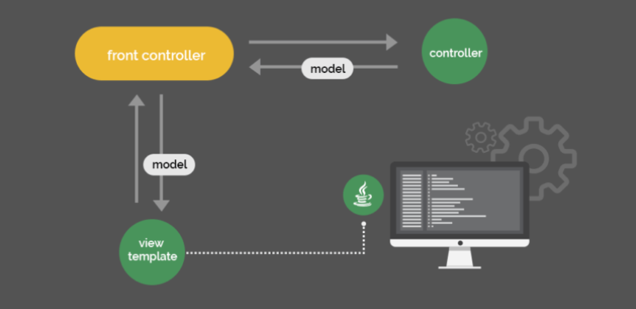
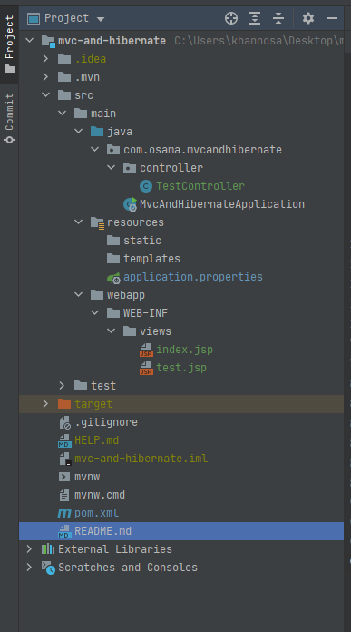

# Spring Boot MVC and Hibernate Demo 💽

This is a demo project that is developed using hibernate and Spring-MVC on Spring Boot.

## Front Controller Working

`Servlet` or `Dispatcher Servlet` is actually the `front-controller` of a Spring-MVC application. Web Servlet is configured automatically in spring-boot, there is no need to add boilerplate code for that.

## Project Setup

* [This resource](https://www.boraji.com/spring-boot-creating-web-application-using-spring-mvc) helped in creating MVC project with Spring-boot.
* Create a new Spring Boot Project using **Spring Initializr**
* Download and open the folder.
* Make sure to add the following dependencies in your `pom.xml` file.

[comment]: <> (Project pom file)

Click to see pom file contents...

    <?xml version="1.0" encoding="UTF-8"?>
    <project xmlns="http://maven.apache.org/POM/4.0.0" xmlns:xsi="http://www.w3.org/2001/XMLSchema-instance"
        xsi:schemaLocation="http://maven.apache.org/POM/4.0.0 https://maven.apache.org/xsd/maven-4.0.0.xsd">
        <modelVersion>4.0.0</modelVersion>
        <parent>
            <groupId>org.springframework.boot</groupId>
            <artifactId>spring-boot-starter-parent</artifactId>
            <version>2.4.2</version>
            <relativePath/> <!-- lookup parent from repository -->
        </parent>
        <groupId>com.osama</groupId>
        <artifactId>mvc-and-hibernate</artifactId>
        <version>0.0.1-SNAPSHOT</version>
        <name>mvc-and-hibernate</name>
        <description>Demo project for Spring Boot</description>
        <properties>
            <java.version>11</java.version>
        </properties>
        <dependencies>
            <dependency>
                <groupId>org.springframework.boot</groupId>
                <artifactId>spring-boot-starter-web</artifactId>
            </dependency>
            <!-- JSTL tag lib -->
            <dependency>
                <groupId>javax.servlet.jsp.jstl</groupId>
                <artifactId>javax.servlet.jsp.jstl-api</artifactId>
                <version>1.2.1</version>
            </dependency>
    
            <dependency>
                <groupId>taglibs</groupId>
                <artifactId>standard</artifactId>
                <version>1.1.2</version>
            </dependency>
    
            <!-- Tomcat for JSP rendering -->
            <dependency>
                <groupId>org.apache.tomcat.embed</groupId>
                <artifactId>tomcat-embed-jasper</artifactId>
                <scope>provided</scope>
            </dependency>
            <dependency>
                <groupId>org.springframework.boot</groupId>
                <artifactId>spring-boot-starter-test</artifactId>
                <scope>test</scope>
            </dependency>
        </dependencies>
    
        <build>
            <plugins>
                <plugin>
                    <groupId>org.springframework.boot</groupId>
                    <artifactId>spring-boot-maven-plugin</artifactId>
                </plugin>
            </plugins>
        </build>
    
    </project>

* Create a package named `controller` and add a test-controller class.
  
[comment]: <> (Controller class contents)

Click to see TestController contents...

    package com.osama.mvcandhibernate.controller;
    
    import org.springframework.stereotype.Controller;
    import org.springframework.web.bind.annotation.GetMapping;
    import org.springframework.web.bind.annotation.RequestMapping;
    
    @Controller
    public class TestController {
    
        @RequestMapping("/")
        public String index() {
            return "index";
        }
    
        @GetMapping("/hello")
        public String hello() {
            return "test";
        }
    }

* Create the directory `java/webapp/WEB-INF/views`.
* Add `index.jsp` and `test.jsp` files in the `java/webapp/WEB-INF/views` directory.
* Add the following contents in the `application.properties` file:

[comment]: <> (application.properties file contents)

application.properties file contents... 

    server.port = 4200
    spring.mvc.view.prefix = /WEB-INF/views/
    spring.mvc.view.suffix = .jsp
    spring.mvc.static-path-pattern=/resources/**

* The complete directory structure:

[comment]: <> (Directory Structure)

Click to see directory structure...

